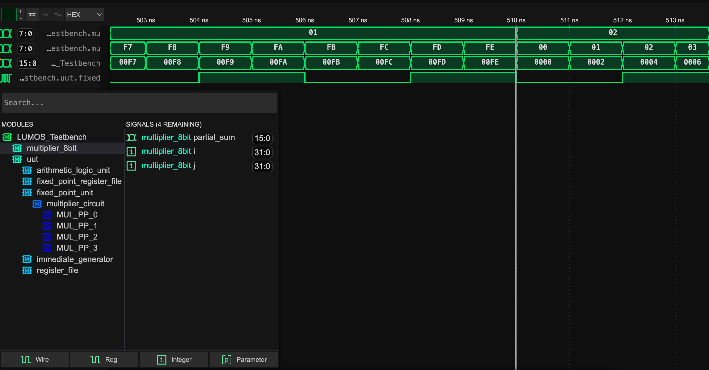
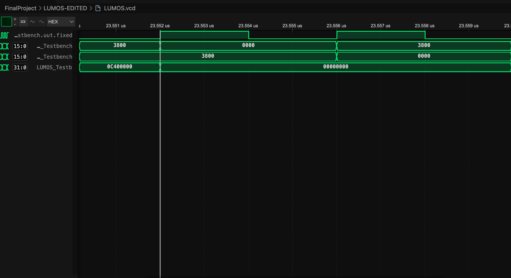

<div  style="direction: rtl;text-align: justify;">
<h3 style="text-align: center;">  به نام خدا</h3>
<br>

<div align="center">


</div>

<br>

<h2 style="text-align: center;">
پروژه پایانی اجزا کامپیوتر

ضرب کننده ۸ بیتی به ۱۶ بیتی

</h2>

<h3 style="text-align: justify;">
اعضای گروه:
<br>
<br>

- عرفان انصاری
- مهدی عابدی
- دانیال دانشمند

<h3>

<div style="page-break-after: always;"></div>

# گزارش کار ماژول Multiplier

<span style="color:red">

## نکات قبل آغاز

</span>

- باتوجه به متفاوت بودن نحوه‌ی آدرس دهی در فایل های ویندوز و بقیه سیستم عامل ها فایل های مرتبط با کتاب خانه‌های استفاده شده در بنچ تست ها، با آدرس متفاوت بود و درصورتی که از سیستم عامل ویندوز استفاده می‌کنید؛ ابتدا آدرس دهی ها را اصلاح و بعد از آن فایل ها را اجرا کنید .

## معرفی ماژول

ماژول `Multiplier` یک ضرب‌کننده دودویی است که وظیفه ضرب دو عدد 8 بیتی (`operand_1` و `operand_2`) را بر عهده دارد و نتیجه نهایی را به صورت یک عدد 16 بیتی (`product`) ارائه می‌دهد. این ماژول از روش آرایه‌ای برای محاسبه استفاده می‌کند که بر اساس تولید و جمع جزئی حاصل‌ضرب‌های بیت به بیت طراحی شده است.

## اجزای اصلی ماژول

### ورودی‌ها و خروجی‌ها

- **`operand_1`**: عدد 8 بیتی اول.
- **`operand_2`**: عدد 8 بیتی دوم.
- **`product`**: خروجی 16 بیتی که حاصل‌ضرب نهایی دو عدد را نشان می‌دهد.

### متغیرهای داخلی

- **`partial_sum`**: حاصل‌جمع جزئی که به تدریج با جمع‌بندی حاصل‌ضرب‌های جزئی پر می‌شود.
- **`partial_products[7:0]`**: آرایه‌ای که حاصل‌ضرب هر بیت از `operand_1` با هر بیت از `operand_2` را ذخیره می‌کند.
- **`i` و `j`**: متغیرهای شمارنده برای پیمایش در بیت‌های ورودی.

---

<div style="page-break-after: always;"></div>

## عملکرد ماژول

### 1. مقداردهی اولیه

در ابتدا:

- مقدار خروجی `product` به `16'b0` مقداردهی می‌شود.
- متغیر `partial_sum` نیز صفر می‌شود تا برای جمع‌بندی آماده شود.

### 2. تولید حاصل‌ضرب‌های جزئی

این بخش شامل دو حلقه تو در تو است که حاصل‌ضرب بیت به بیت `operand_1` و `operand_2` را محاسبه و در آرایه `partial_products` ذخیره می‌کند:

- حلقه بیرونی (`i`) بیت‌های `operand_1` را پیمایش می‌کند.

- حلقه درونی (`j`) بیت‌های `operand_2` را پیمایش می‌کند.

- حاصل ضرب هر بیت از `operand_1` با هر بیت از `operand_2` در آرایه `partial_products[i][j]` ذخیره می‌شود:

<div style="direction: ltr;">

```verilog
partial_products[i][j] <= operand_1[i] & operand_2[j];
```

</div>

### 3. جمع‌بندی حاصل‌ضرب‌های جزئی

برای محاسبه حاصل‌ضرب نهایی، آرایه `partial_products` پردازش می‌شود:

- حلقه‌ای که هر ردیف از `partial_products` را با توجه به موقعیت بیت شیفت داده و به `partial_sum` اضافه می‌کند:

<div style="direction: ltr;">

```verilog
partial_sum = partial_sum + (partial_products[i] << i);
```

</div>

### 4. مقداردهی خروجی

پس از تکمیل جمع‌بندی، مقدار `partial_sum` به `product` اختصاص داده می‌شود:

<div style="direction: ltr;">

```verilog
product <= partial_sum;
```

</div>

## نکات کلیدی در طراحی

1. **روش آرایه‌ای:**
   - این روش با تولید حاصل‌ضرب‌های بیت به بیت و جمع‌بندی شیفت داده شده آنها، محاسبه را انجام می‌دهد.
2. **سادگی در طراحی:**
   - استفاده از حلقه‌ها و آرایه‌ها طراحی را ساده و قابل فهم کرده است.
3. **دقت در مقداردهی اولیه:**
   - صفر کردن متغیرهای داخلی (`product` و `partial_sum`) برای جلوگیری از محاسبات اشتباه.

## کد کامل تابع

<div style="direction: ltr;">

```verilog
module Multiplier (
    input wire [7:0] operand_1,
    input wire [7:0] operand_2,
    output reg [15:0] product
);
    reg [15:0] partial_sum;
    reg [7:0] partial_products[7:0];
    integer i, j;
    always @(*) begin
        product <= 16'b0;
        partial_sum = 16'b0;

        for (i = 0; i < 8; i = i + 1) begin
            for (j = 0; j < 8; j = j + 1) begin

                partial_products[i][j] <= operand_1[i] & operand_2[j];
            end
        end
        for (i = 0; i < 8; i = i + 1) begin
            partial_sum = partial_sum + (partial_products[i] << i);
        end


        product <= partial_sum;
    end

endmodule
```

</div>

<div style="page-break-after: always;"></div>

## خروجی نهایی تابع

### خروجی سیگنال ها

تصویر زیر نشان‌دهنده ی ازمون جداگانه از ماژول استفاده شده است که همانطور که مشاهده میکنید دو عدد ۸ بیتی ضرب و درنهایت یک عدد ۱۶ بیتی تحویل میدهد و با توجه به خروجی تابع و نمونه اعدادی که مشاهده می‌شوند میتوان به صحت کارکردی تابع اطمینان پیدا کرد.



<div style="page-break-after: always;"></div>
شکل زیر قسمتی از مجموعه سیگنال های ورودی و خروجی به cpu است که قسمتی محدودی از بازه زمانی راه نشان میدهد و همانطور که مشاهده میکنید با استفاده از ماژول نوشته شده اعداد ۱۶ بیتی در چند مرحله دریافت و خروجی ۳۲ بیتی تحویل میدهد و با توجه به مقادیر در تصویر اماده تابع کاملا دقیق درست به جواب های نهایی میرسد.



## مزایا و معایب

### مزایا

- پیاده‌سازی ساده و قابل فهم.
- استفاده بهینه از حلقه‌ها برای کاهش پیچیدگی کد.

### معایب

- محاسبات در این روش ممکن است زمان‌بر باشد، زیرا هر بیت به صورت جداگانه پردازش می‌شود.
- استفاده از آرایه‌های داخلی ممکن است حافظه بیشتری مصرف کند.

</div>
